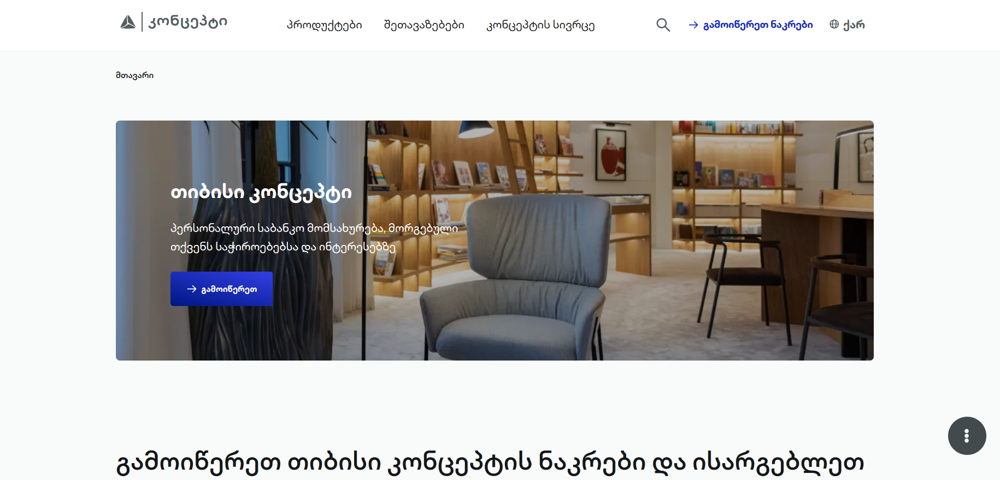

[Deployment Link]()

# TBC x USAID React Accelerator Program -- Project Overview

This is my solution of tbcconcept technical task.

## Screenshot

## Links

- Solution URL: [Add solution URL here](https://github.com/levansarishvili/tbc-concept)
- Live Site URL: [Add live site URL here](https://levansarishvili.github.io/tbc-concept/)

## Built with

- Semantic HTML5 markup
- CSS custom properties
- Flexbox
- CSS Grid
- Responsive Design
- Desktop-first workflow
- Javascript ES6
- Swiper JS

## Author

- Portfolio/Resume - [Add your name here](https://levansarishvili.github.io/my-cv/)
- Linkedin - [@yourusername](https://www.linkedin.com/in/levan-sarishvili-b87245b1/)
